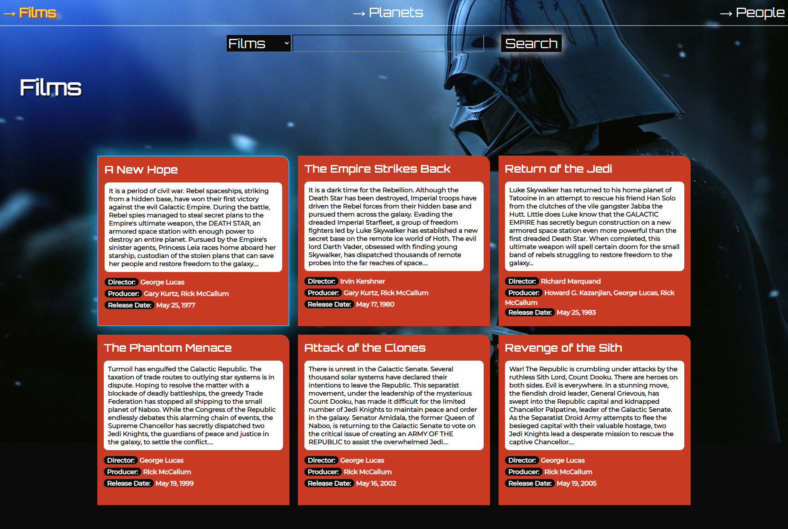
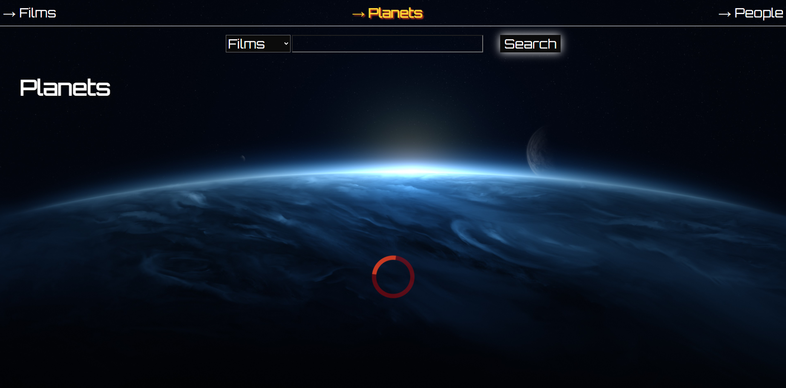
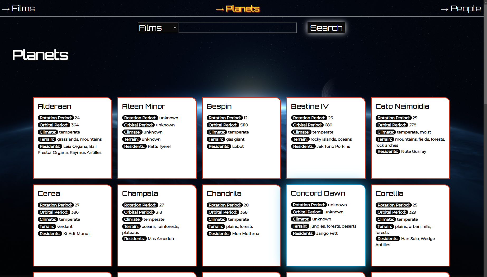
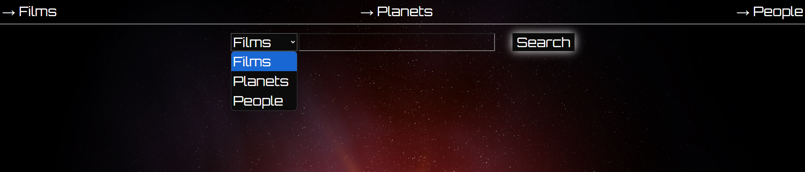
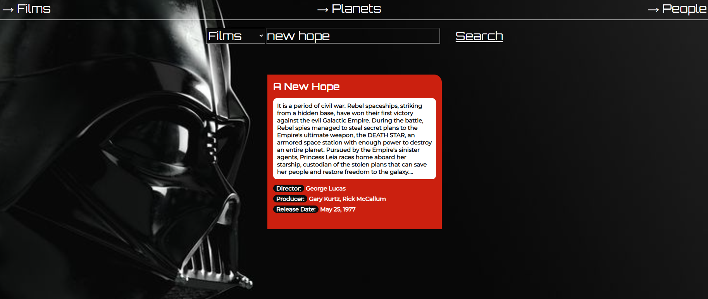

# **Projekt Star Wars**

Willkommen zu meinem Projekt "Star Wars", einer interaktiven App, die Daten zu Filmen, Planeten und Personen aus dem Star-Wars-Universum zeigt! 🎥🌌

## **Live-Demo**

[Hier kannst du das Projekt live ausprobieren!](https://manonsfoto.github.io/API_Project_StarWars/)

---

## **Features**

- **Navigation**:
  - Intuitive Navigation zu Filmen, Planeten und Personen.
- **Listenansicht**:
  - Alle Filme, Planeten und Personen werden in übersichtlichen Listen dargestellt.
- **Suchfunktion**:
  - Benutzerfreundliche Suchoptionen, um gezielt nach Filmen, Planeten oder Personen zu suchen.

---

## **Technologien**

- **TypeScript**
- **HTML/CSS**
- **Fetch API**: Zur Kommunikation mit der [SWAPI (Star Wars API)](https://swapi.dev/documentation).

---

### **Vorschau der App**

---

## **Herausforderungen**

1. **Langsame API-Ladezeiten**:

   - **Problem**: Beim Laden vieler Daten von der API traten Verzögerungen auf.
   - **Lösung**: `Promise.all` wurde implementiert, um parallele Anfragen auszuführen. Dadurch wurden die Ladezeiten reduziert.

2. **Pagination (nächste/vorherige Seite)**:
   - **Problem**: Statt die `next`- und `previous`-Links der API zu nutzen, habe ich einen eigenen Page-Calculator implementiert. Dies hat unnötige Komplexität hinzugefügt.
   - **Lesson Learned**: In zukünftigen Projekten werde ich die API-Funktionalitäten wie `next` und `previous` direkt nutzen, um die Codebasis schlanker und effizienter zu gestalten.
